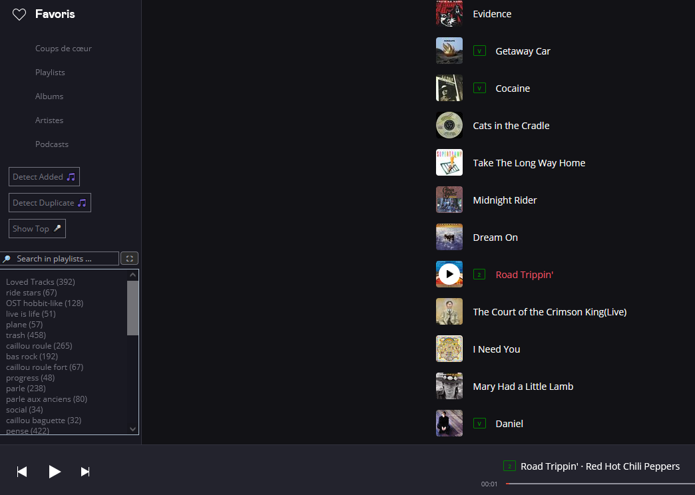

# Deezier
A native-JS userscript enhancing your experience listening music on Deezer with new useful features.

## Current features

Deezier injects itself in the Deezer sidebar at the webpage loading. This center of command allows you to use all the features of Deezier :

 
The results of researches/actions are summarized in the tight area injected. For convenience and access to more advanced features, this can be expanded using the button beside the sidebar :

Supported features :
- Listing of your personal playlists directly accessible on your sidebar
- Instant research walking through all your playlists, matching artist names and track titles
- In-page detection of tracks already present in your playlists, marked with a little green icon beside (see screenshots above)
- Detection of duplicated tracks of the same artists ("Everlong" and "Everlong (acoustic)" in the same playlist are likely an error)

NOTE : Deezier doesn't work on a dynamic way, meaning that if you add a track to a playlist, don't expect it to show up in the Deezier library until you do a F5.

## Installation

Install an user-script manager like [Greasemokey](https://addons.mozilla.org/fr/firefox/addon/greasemonkey/) and [Violentmonkey](https://violentmonkey.github.io/get-it/) and simply load in the [script](./deezier.js). Deezier is JS-native and doesn't need any dependency.

----

TODO:
- Don't use timer to wait deezer loads but DOM instead
- Feature : Detect Duplicate
- Library fullscreen view
- Caching using local storage
- Feature : add songs to 'next to play' or in a customized user's playlist
- Feature : play all new songs in notifications
- Refresh library button
- 'Add to playlist' button in player view
